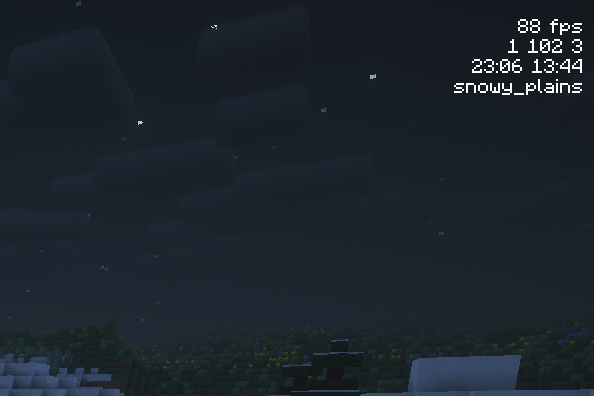

# FPS XYZ Mod

Minecraft Fabric에서 FPS, 좌표, 시간, 바이옴 정보를 화면에 표시해주는 클라이언트 모드입니다.



## 지원 버전

- Minecraft: `26.1.2`
- Fabric Loader: `0.19.2` 이상
- Fabric API: `0.146.1+26.1.2`
- Java: `25` 이상
- ModMenu: `18.0.0-alpha.8`

## 주요 기능

### 화면 표시 정보
- FPS (Frames Per Second)
- 현재 좌표 (X, Y, Z)
- 현재 바이옴(Biome)
- 게임 내 시간
- 실제 시간

### 커스터마이징
- 각 정보의 표시 여부 설정
- 좌표 구분자 설정
    - 예: 공백, `, `, ` | ` 등
- 현재 바라보는 방향의 축 표시
    - 동쪽: `X+`
    - 서쪽: `X-`
    - 남쪽: `Z+`
    - 북쪽: `Z-`
- 텍스트 크기 조절
- 표시 위치 설정 (좌측 상단/우측 상단)

### 설정 UI
- ModMenu에서 설정 화면을 열 수 있습니다.
- `Display`, `XYZ`, `General` 섹션으로 표시 옵션을 관리합니다.
- `Done`을 누를 때 설정을 한 번에 저장하고, `Cancel`로 변경사항을 버릴 수 있습니다.

## 성능 최적화
- 정보별 최적화된 업데이트 주기 적용
    - 실제 시간: 1초
    - FPS: 250ms
    - 바이옴: 16블록 이동시
    - 게임 시간: 50ms
- 좌표 포맷 결과 캐싱
- 텍스트 컴포넌트/폭 캐싱으로 렌더링 성능 향상
- 설정 저장 시 변경분을 모아 디스크 쓰기 횟수 최소화

## 빌드

```bash
./gradlew build
```

빌드에는 JDK 25가 필요합니다.
